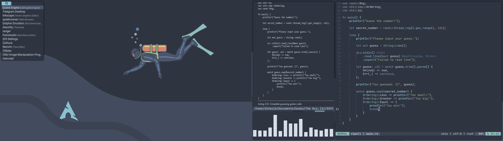

**Table of Contents**

- [What is doob](#what-is-doob)
  - [Features](#features)
- [Installation](#installation)
  - [Dependencies](#dependencies)

# What is doob


Once a fearful fellow decided to fear no more. Geared up and dives
deep to find out what lies beneath the surface.

doob (ডুব) is a bangla word which means 'deep dive'.
doob is a Linux theme in general. It embraces modern minimalist
and material styling and follows its core guidelines
as much as possible in theming each module so that they look
aesthetically pleasing to eyes and feel related to each other.

## Features

- **Minimalist Design:** leaves unnecessary features for
  clutter free experience.
- **Nord ColorScheme:** one of the most visually pleasing
  color scheme out there.
- **Modular Approach:** user can leave unwanted module and it
  will not crash.
- **Removal of The Bar:** gives more working space and it is
  radial symmetrical.
- **Info Through ZSH Theme:** gives info like battery
  status and current times through zsh.
- **VI-Like Key Bindings:** for natural navigation purposes.

# Installation

```bash
git clone https://github.com/d1hasib/doob
cd doob
sh ./install.sh [module1] [module2] ...
```

Currently available theme modules are:-

- zsh

**Important Note:** Before installing any module check if
the dependencies are met or not.

## Dependencies

### zsh

| Dependencies                                              | Description                  |
| --------------------------------------------------------- | ---------------------------- |
| [zsh](http://zsh.sourceforge.net)                         | enable vi-mode: `bindkey -v` |
| [powerlevel10k](https://github.com/romkatv/powerlevel10k) | config will be overwritten   |
| [nerd font](https://www.nerdfonts.com/)                   | to display p10k icons        |
